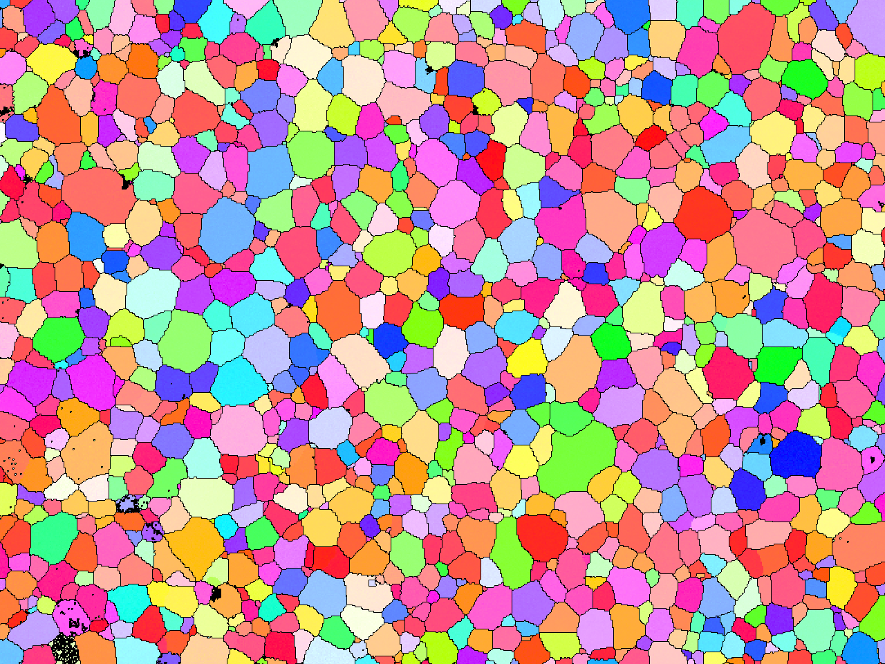
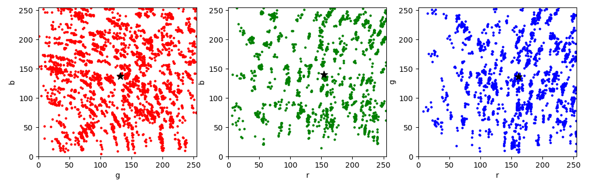

# EBSD_data_analysis

## Table of Content
1. [Description](README.md#Description)
2. [Requirements](README.md#Requirements)
3. [Usage](README.md#Usage)
4. [Modules](README.md#Structure)
5. [Contact](README.md#Contact)

## Description
This program is to extract the information in an EBSD ipf map and represent a complete picture with a small number of parameters.

## Requirements
- numpy
- matplotlib
- sklearn
- cv2
- math
- scipy
- random
- pandas
- pymongo
- csv
- xlrd
- json

## Usage
1. Installation
After installing the libraries mentioned in requirements, you can use this program.

2. Load data
At present, it mainly supports pictures in formats such as jgp, png, and bmp, and we will upload programs that support pictures in formats such as tiff, hdf5 in the future.

3. Analysis
To minimize the number of parameters that need to be saved, we default the number of clusters to 3. Of course, you can also simply change the code to increase the number of clusters as needed.

   Finally, the information we get through an EBSD ipf map is: 1. The number of grains contained in the image and their average size; 2. The 3 most representative RGB    values (representing orientation information) and their concentrations (expressed with a Gaussian distribution).

4. Database
We use 'mongoDB' to efficiently store data, including the above analysis data and various data related to the performance obtained from papers or experiments.

   In this way, we can build a database of EBSD images associated with material properties. It should be noted that each piece of data will only take up very little      storage space.

## Contact
Please contact Su Yang at [77303474@qq.com](mailto:77303474@qq.com) if you have any questions or suggestions.
