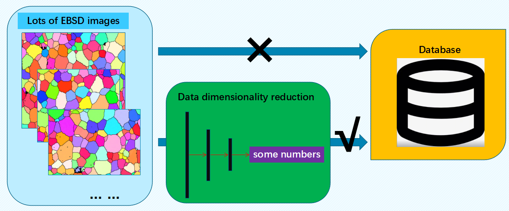
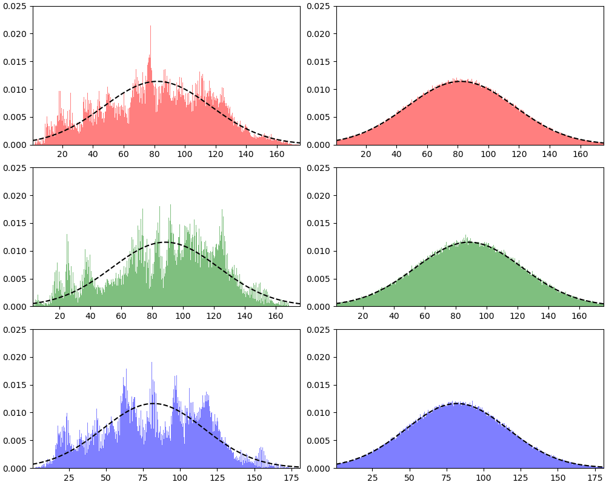
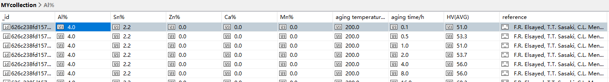

# EBSD_data_analysis

## Table of Content
1. [Description](README.md#Description)
2. [Requirements](README.md#Requirements)
3. [Usage](README.md#Usage)
4. [Modules](README.md#Structure)
5. [Contact](README.md#Contact)

## Description
This program is going to store Mg alloy data into a MongoDB database.
In order to store the microstructure data in a proper way, we developed a specific code to extract useful crystal orientation distribution information from a typical electron backscattered diffraction image.

## Requirements
- numpy
- matplotlib
- sklearn
- cv2
- math
- scipy
- random
- pandas
- pymongo
- csv
- xlrd
- json

## Usage
1. Data from papers
First, you need to get the composition and process of the material etc. from the published paper and document it. It can be written to excel file or csv file, you can also log this information directly using code, this feature will be mentioned in the modules section

2. Installation
After installing the libraries mentioned in requirements, you can use this program.

3. Load data
③　From the paper we download the EBSD image of the material you would expect to store, obviously this will take up a lot of disk space if you save it directly to the database. Therefore, there is a need for a smarter way to store the useful information contained in EBSD pictures. Fortunately, we can implement this idea with this code.

Fig.1 EBSD IPF map

4. Analysis
To minimize the number of parameters that need to be saved, we default the number of clusters to 3. Of course, you can also simply change the code to increase the number of clusters as needed.

Fig.2 The three parts of RGB and their cluster center points

   Finally, the information we get through an EBSD ipf map is: 1. The number of grains contained in the image and their average size; 2. The 3 most representative RGB    values (representing orientation information) and their concentrations (expressed with a Gaussian distribution).

Fig.3 The three images on the left represent the Gaussian distribution of the original image; the three figures on the right represent the Gaussian distribution in the database

5. Database
Using this code, you can store csv and excel data in the mongo database with one click. We use 'mongoDB' to efficiently store data, including the above analysis data and various data related to the performance obtained from papers or experiments.

Fig.4 Each piece of data in the ‘mongo’ database

   In this way, we can build a database of EBSD images associated with material properties. It should be noted that each piece of data will only take up very little      storage space.

## Contact
Please contact Su Yang at [77303474@qq.com](mailto:77303474@qq.com) if you have any questions or suggestions.
